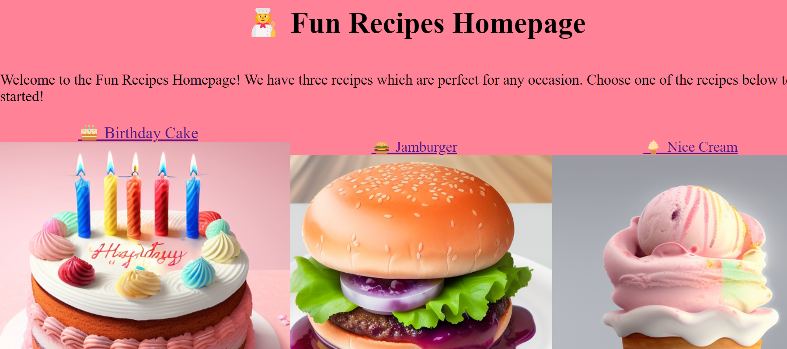

# 👉 https://admart128.github.io/odin-recipes/

A small HTML/CSS project completed as part of a larger coding curriculum (The Odin Project, https://www.theodinproject.com/).

"In this project, you are going to build a basic recipe website."

I used ChatGPT and Stable Diffusion to generate all text and images for this project.
This allowed me to spend more of my time practicing HTML and CSS.

